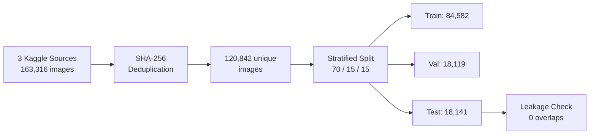
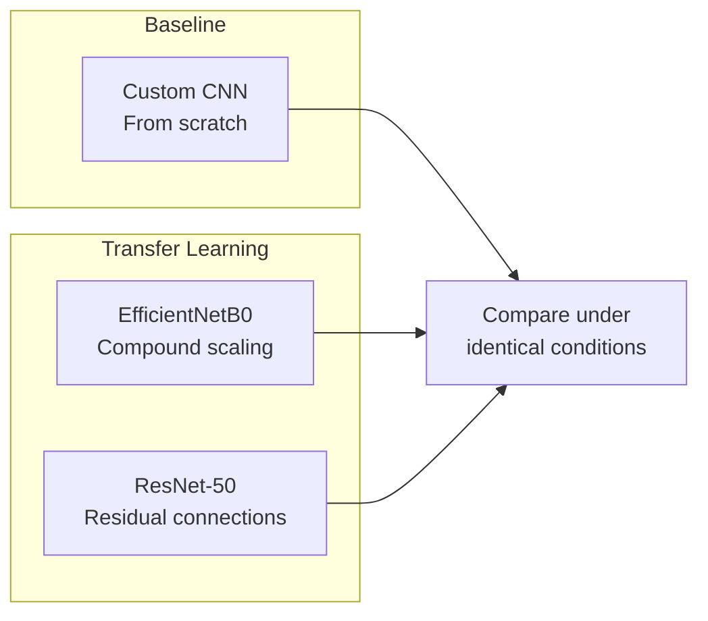
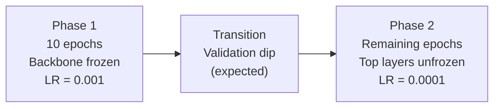
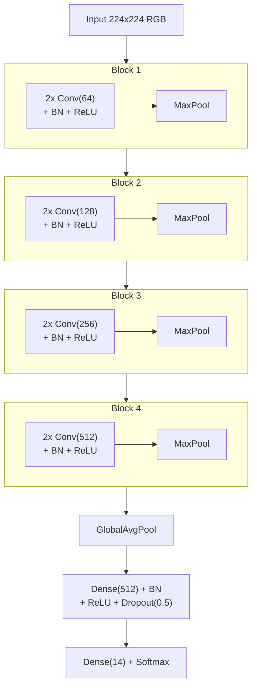

# Experiment 1: CNN Architecture Comparison

**Module:** MOD002691 Computing Project
**Task:** Classify 14 produce classes across 120,842 images
**Selected model:** EfficientNetB0 (99.75% accuracy, 40 MB)

## Contents

- [Research Question](#research-question)
- [Results](#results)
- [Repository Structure](#repository-structure)
- [Hardware Selection](#hardware-selection)
- [Dataset Pipeline](#dataset-pipeline)
- [Architecture Selection](#architecture-selection)
- [Training Protocol](#training-protocol)
- [Model Architectures](#model-architectures)
- [Detailed Results](#detailed-results)
- [Analysis](#analysis)
- [Model Selection for Experiment 2](#model-selection-for-experiment-2)
- [Limitations](#limitations)
- [How to Reproduce](#how-to-reproduce)
- [Requirements](#requirements)
## Research Question

> Which CNN architecture achieves the best trade-off between classification accuracy and computational efficiency for food image recognition, when trained under identical conditions?

The answer must account for both raw performance (accuracy, macro-F1) and deployment fitness (model size, parameter count). In Experiment 2, the selected model runs once per bounding-box crop inside a YOLO+CNN pipeline, so efficiency matters as much as accuracy.

## Results

| Model | Test Accuracy | Macro F1 | Parameters | Model Size | Training Time | Epochs |
|---|---|---|---|---|---|---|
| Custom CNN | 98.34% | 0.9823 | 4.96M | 56.9 MB | ~24.8 h | 81 |
| EfficientNetB0 | 99.75% | 0.9972 | 4.07M | 40.0 MB | 10.96 h | 42 |
| ResNet-50 | **99.77%** | **0.9973** | 24.13M | 211.0 MB | 8.13 h | 32 |

ResNet-50 leads by 0.02%, but the Wilson 95% confidence intervals overlap on 18,141 test samples. The difference is not statistically significant. EfficientNetB0 is 5.3x smaller and was selected for Experiment 2.

## Repository Structure

```
.
├── notebooks/
│   ├── 01_hardware_accelerator_benchmark.ipynb
│   ├── 02_dataset_preparation.ipynb
│   ├── 03_custom_cnn_training.ipynb
│   ├── 04_efficientnet_training.ipynb
│   ├── 05_resnet50_training.ipynb
│   └── 06_model_comparison.ipynb
└── README.md
```

Run notebooks in order. Each depends on the outputs of the previous one. All notebooks are designed for Google Colab with a T4 GPU runtime.

> Prior development versions are preserved on the `archive` branch under `v1/` and `v2/`.

## Hardware Selection

*Notebook: `01_hardware_accelerator_benchmark.ipynb`*

A 3-epoch benchmark was run on all available Colab accelerators using the same model and dataset. The goal was to select a single GPU tier for all training runs, removing hardware as a variable.

| Accelerator | Avg Epoch Time | Speedup vs CPU | Cost Tier | Cost Efficiency |
|---|---|---|---|---|
| CPU | 2,378.9 s | 1.0x | 0.5x | baseline |
| **Tesla T4** | **159.96 s** | **14.87x** | **1.0x** | **14.87** |
| NVIDIA L4 | 115.12 s | 20.66x | 2.0x | 10.33 |
| NVIDIA A100 | 113.53 s | 20.95x | 4.0x | 5.24 |

The A100 is only 1.4x faster than the T4 but costs 4x more compute units. The T4 delivers the best speedup per cost unit. All three models were trained on the Tesla T4.

## Dataset Pipeline

*Notebook: `02_dataset_preparation.ipynb`*



### Sources

Three Kaggle datasets were merged:

- `moltean/fruits` (Fruits-360)
- `sshikamaru/fruit-recognition`
- `utkarshsaxenadn/fruits-classification`

### Deduplication

Every image was hashed with SHA-256. Exact duplicates, both within and across sources, were removed before splitting.

| Metric | Count |
|---|---|
| Original images | 163,316 |
| Duplicates removed | 42,474 (26%) |
| Cross-source duplicates | 9,263 |
| **Final unique images** | **120,842** |

Outputs: `deduplication_report.csv`, `dataset_manifest.csv` (per-image SHA-256 hashes).

### Class Mapping

Folder names across sources were inconsistent (e.g. `Apple Braeburn`, `apple_6`, `Apple`). Include/exclude pattern mapping assigned each folder to one of 14 target classes with substring collision prevention.

**14 classes:** apple, banana, bell_pepper_green, bell_pepper_red, carrot, cucumber, grape, lemon, onion, orange, peach, potato, strawberry, tomato

### Split: 70 / 15 / 15

A 15% test split was chosen over 10% because of class imbalance. The dataset has a 113:1 ratio (apple: 45,455 images vs carrot: 402). With a 10% test split, carrot yields ~40 test samples, where a single misclassification shifts F1 by 2.5 percentage points. At 15%, it yields 61 samples, reducing that shift to 1.6 points.

The same reasoning applies to the validation set. Early stopping, learning rate reduction, and model checkpointing all monitor validation accuracy. Noisy validation signals from too few samples cause premature early stopping.

After splitting, all hashes were checked for cross-split overlap. **Zero duplicates found.**

### Class Imbalance

Balanced class weights were computed with scikit-learn's `compute_class_weight` and applied during all training runs.

| Property | Value |
|---|---|
| Train set | 84,582 (70%) |
| Validation set | 18,119 (15%) |
| Test set | 18,141 (15%) |
| Class imbalance ratio | 113:1 |
| Image size | 224x224 RGB |

## Architecture Selection



**Custom CNN (baseline):** Every transfer learning comparison needs a from-scratch baseline. Without it, the question "does transfer learning actually help for this task?" cannot be answered.

**EfficientNetB0:** Compound scaling with depthwise separable convolutions. Maximises accuracy per parameter. The smallest variant in the family, directly relevant for mobile deployment in Experiment 3.

**ResNet-50:** Residual connections solving vanishing gradients in deep networks. The most cited backbone in computer vision and the standard benchmark architecture.

The structure is deliberate: from-scratch baseline vs. efficient modern architecture vs. established heavyweight.

## Training Protocol

All models were trained under identical settings wherever architecture permitted.

| Setting | Value |
|---|---|
| Hardware | Tesla T4 (Google Colab) |
| Dataset | Same split, SHA-256 verified, zero leakage |
| Image size | 224x224 RGB |
| Batch size | 32 |
| Max epochs | 100 |
| Early stopping patience | 15 epochs |
| LR reduction | factor 0.5, patience 5, min 1e-7 |
| Class weights | Applied |
| Random seed | 42 |
| Augmentation | rotation +/-20, shifts/shear/zoom 10%, horizontal flip |

### Two-Phase Fine-Tuning



Both transfer learning models use a two-phase procedure. Phase 1 freezes the pretrained backbone and trains only the classification head. Phase 2 unfreezes a portion of the backbone at a reduced learning rate.

At the Phase 1 to Phase 2 transition, millions of previously frozen parameters begin receiving gradient updates. Validation accuracy temporarily drops before recovering as the newly active weights adapt to the task. Patience 15 was set specifically to accommodate this transition.

### Learning Rate Reduction at Phase 2

The Phase 2 learning rate drops from 0.001 to 0.0001 to prevent catastrophic forgetting. Pretrained weights already encode useful ImageNet representations. A full 0.001 learning rate would overwrite those representations within a few updates. The Custom CNN has no pretrained weights to protect, so a higher learning rate throughout is both safe and beneficial.

## Model Architectures

### Custom CNN

*Notebook: `03_custom_cnn_training.ipynb`*



VGG-style architecture. Four convolutional blocks with increasing filter depth (64, 128, 256, 512). GlobalAveragePooling replaces Flatten to reduce parameters while preserving spatial information.

| Property | Value |
|---|---|
| Total parameters | 4,964,942 |
| Model size | 56.92 MB |
| Pretrained | No |

### EfficientNetB0

*Notebook: `04_efficientnet_training.ipynb`*

EfficientNetB0 pretrained on ImageNet with a lightweight classification head. No intermediate dense layers: EfficientNet's compound-scaled features are expressive enough for a direct projection.

**Fine-tuning depth:** 72 of 238 layers unfrozen at Phase 2 (30%). EfficientNetB0's depthwise separable convolutions are parameter-efficient, so unfreezing 30% exposes only ~3.1M trainable parameters.

| Property | Value |
|---|---|
| Total parameters | 4,072,625 |
| Model size | 40.03 MB |
| Phase 1 trainable | 20,494 (0.08%) |
| Phase 2 trainable | 3,099,626 (76.1%) |
| Layers unfrozen | 72 / 238 (30%) |
| Pretrained | ImageNet |

### ResNet-50

*Notebook: `05_resnet50_training.ipynb`*

ResNet-50 pretrained on ImageNet with a deeper classification head (Dense(256) bottleneck) to match its larger backbone capacity.

**Fine-tuning depth:** 35 of 175 layers unfrozen at Phase 2 (20%). ResNet-50 uses standard convolutions with high parameter density per layer. Unfreezing 20% already exposes ~15.5M trainable parameters, five times more than EfficientNetB0's 30%.

| Property | Value |
|---|---|
| Total parameters | 24,125,070 |
| Model size | 211.03 MB |
| Phase 1 trainable | 532,750 (2.2%) |
| Phase 2 trainable | 15,510,798 (64.3%) |
| Layers unfrozen | 35 / 175 (20%) |
| Pretrained | ImageNet |

## Detailed Results

*Notebook: `06_model_comparison.ipynb`*

### Overall Performance

| Metric | Custom CNN | EfficientNetB0 | ResNet-50 |
|---|---|---|---|
| Test Accuracy | 98.34% | 99.75% | **99.77%** |
| Test Loss | 0.0485 | 0.0207 | **0.0128** |
| Macro Precision | 0.9746 | 0.9977 | 0.9974 |
| Macro Recall | 0.9911 | 0.9968 | 0.9973 |
| Macro F1 | 0.9823 | 0.9972 | **0.9973** |

### Statistical Significance

Wilson score 95% confidence intervals on 18,141 test samples:

| Model | Accuracy | 95% CI |
|---|---|---|
| Custom CNN | 98.34% | [98.14%, 98.52%] |
| EfficientNetB0 | 99.75% | [99.67%, 99.81%] |
| ResNet-50 | 99.77% | [99.69%, 99.83%] |

Custom CNN vs. transfer models: non-overlapping intervals. The gap (~1.4 to 1.8%) is statistically significant.

EfficientNetB0 vs. ResNet-50: overlapping intervals. The 0.02% difference is within statistical noise.

### Per-Class F1 Scores

| Class | Custom CNN | EfficientNetB0 | ResNet-50 |
|---|---|---|---|
| apple | 0.9825 | 0.9973 | 0.9977 |
| banana | 0.9070 | 0.9865 | 0.9904 |
| bell_pepper_green | 1.0000 | 1.0000 | 1.0000 |
| bell_pepper_red | 1.0000 | 1.0000 | 1.0000 |
| carrot | 1.0000 | 1.0000 | 1.0000 |
| cucumber | 0.9998 | 1.0000 | 1.0000 |
| grape | 0.9359 | 0.9888 | 0.9893 |
| lemon | 1.0000 | 1.0000 | 1.0000 |
| onion | 1.0000 | 1.0000 | 1.0000 |
| orange | 1.0000 | 1.0000 | 1.0000 |
| peach | 1.0000 | 1.0000 | 1.0000 |
| potato | 1.0000 | 1.0000 | 1.0000 |
| strawberry | 0.9272 | 0.9888 | 0.9852 |
| tomato | 1.0000 | 1.0000 | 1.0000 |

10 of 14 classes achieve F1 = 1.000 across all three models. The differentiation sits in three visually similar classes: banana, grape, and strawberry.

### Efficiency

| Metric | Custom CNN | EfficientNetB0 | ResNet-50 |
|---|---|---|---|
| Parameters | 4.96M | **4.07M** | 24.13M |
| Model size | 56.9 MB | **40.0 MB** | 211.0 MB |
| Single-image inference | **64.97 ms** | 68.70 ms | 68.23 ms |
| Batch inference (per image) | **7.09 ms** | 14.10 ms | 10.10 ms |

Single-image inference is comparable across all three (~65 to 69 ms). Model size is a more meaningful differentiator for deployment.

## Analysis

### Why Transfer Learning Wins

The Custom CNN reaches 98.34%, which is strong for a from-scratch model. But the per-class breakdown reveals the problem: banana (0.907), strawberry (0.927), and grape (0.936) all show low precision with high recall. The model recalls those classes well but generates false positives by confusing visually similar items.

The root cause is feature depth. At 84K training images, the Custom CNN develops robust colour and shape representations but lacks the fine-grained texture and surface features needed to separate, for instance, red grapes from certain apple varieties. Both transfer learning models fix this immediately, jumping above 0.985 F1 on all three weak classes. ImageNet pretraining provides exactly the low- and mid-level feature vocabulary (edge directions, texture gradients, surface normals) that the Custom CNN cannot fully acquire from this dataset alone.

### Training Curves

**Transfer models:** Both show a validation dip at the Phase 1 to Phase 2 transition (epoch 10 to 11). This is the expected result of unfreezing millions of frozen parameters. The model temporarily destabilises before the lower learning rate guides it back to stability. Patience 15 accommodates this.

**Custom CNN:** Shows volatile validation oscillations between epochs 5 and 25. Training from scratch with 113:1 class imbalance and class weights means a single minority-heavy batch can spike the weighted loss. After epoch 30, representations stabilise and convergence becomes steady.

### Convergence

ResNet-50 converges in 32 epochs, EfficientNetB0 in 42, Custom CNN in 81. Starting from a pre-adapted feature space rather than random initialisation cuts training time by more than half.

## Model Selection for Experiment 2

The selection criterion is the best accuracy-to-efficiency trade-off, not the raw accuracy maximum.

ResNet-50 leads by 0.02%. The Wilson 95% confidence intervals overlap completely. This difference is not statistically significant.

| Criterion | EfficientNetB0 | ResNet-50 | Advantage |
|---|---|---|---|
| Model size | 40.0 MB | 211.0 MB | EfficientNetB0 (5.3x) |
| Parameters | 4.07M | 24.13M | EfficientNetB0 (5.9x) |
| Training time | 10.96 h | 8.13 h | ResNet-50 (1.3x) |
| Inference latency | 68.70 ms | 68.23 ms | Comparable |

In Experiment 2's Pipeline C (YOLO + CNN), the classifier runs once per bounding-box crop. An image with eight fruits produces eight CNN calls. Deploying a 211 MB model in that loop instead of a 40 MB model with equivalent accuracy is not justified. On mobile or edge hardware (Experiment 3), this gap widens further.

**EfficientNetB0 is selected as the classifier for Experiment 2.**

## Limitations

**Studio-quality images.** The source datasets use controlled backgrounds and lighting. In real-world conditions (variable lighting, partial occlusion, textured backgrounds), the gap between the Custom CNN and transfer models may be larger.

**Single data split.** Five-fold cross-validation would produce more robust variance estimates but would require ~150+ GPU hours across three models. A single large test set (n = 18,141) with Wilson confidence intervals partially compensates, but variance across splits remains unknown.

**Custom CNN training time.** The training session was interrupted and resumed from a checkpoint. The ~24.8 hour total is an extrapolation from recorded session durations, with roughly +/-10% uncertainty.

**Fine-tuning depth.** EfficientNetB0 unfreezes 30%; ResNet-50 unfreezes 20%. These follow established guidelines for each architecture and were not exhaustively searched.

**Inference benchmarks.** Measured on Colab instances subject to variable load. Reported latencies should be treated as relative comparisons, not absolute deployment numbers.

## How to Reproduce

All notebooks run on Google Colab. Select **Tesla T4** for consistency.

| Step | Notebook | Purpose | Outputs |
|---|---|---|---|
| 1 | `01_hardware_accelerator_benchmark.ipynb` | GPU selection | Benchmark table |
| 2 | `02_dataset_preparation.ipynb` | Download, deduplicate, split | Dataset zip, manifest, class weights |
| 3 | `03_custom_cnn_training.ipynb` | Train Custom CNN | Saved model, training history |
| 4 | `04_efficientnet_training.ipynb` | Fine-tune EfficientNetB0 | Saved model, training history |
| 5 | `05_resnet50_training.ipynb` | Fine-tune ResNet-50 | Saved model, training history |
| 6 | `06_model_comparison.ipynb` | Statistical comparison | Comparison CSVs, visualisations |

Each notebook has a Drive mount and path configuration cell at the top. Adjust paths to match your Drive structure.

## Requirements

```
tensorflow>=2.15
numpy
pandas
matplotlib
seaborn
scikit-learn
```

All dependencies are available in the standard Colab environment.

---

*MOD002691 Computing Project.*
