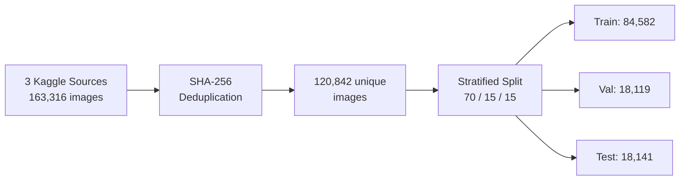
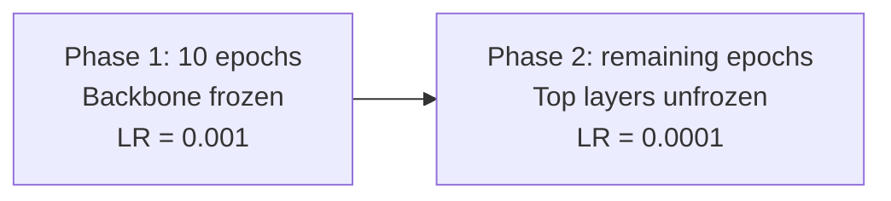
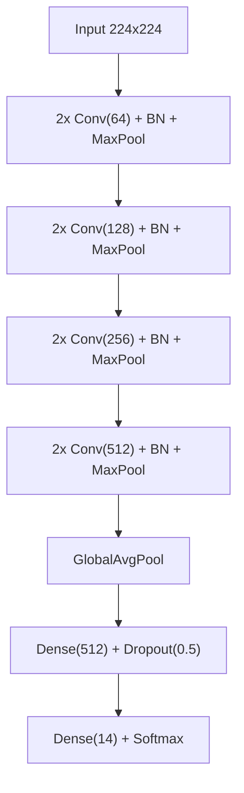

# Experiment 1: CNN Architecture Comparison

**Module:** MOD002691 Computing Project
**Task:** Classify 14 produce classes across 120,842 images
**Selected model:** EfficientNetB0 (99.75% accuracy, 40 MB)

## Results

| Model | Test Accuracy | Macro F1 | Parameters | Model Size | Training Time | Epochs |
|---|---|---|---|---|---|---|
| Custom CNN | 98.34% | 0.9823 | 4.96M | 56.9 MB | ~24.8 h | 81 |
| EfficientNetB0 | 99.75% | 0.9972 | 4.07M | 40.0 MB | 10.96 h | 42 |
| ResNet-50 | **99.77%** | **0.9973** | 24.13M | 211.0 MB | 8.13 h | 32 |

EfficientNetB0 and ResNet-50 differ by 0.02% (Wilson 95% CIs overlap). EfficientNetB0 is 5.3x smaller, so it was selected for Experiment 2.

## Repository Structure

```
.
├── notebooks/
│   ├── 01_hardware_accelerator_benchmark.ipynb
│   ├── 02_dataset_preparation.ipynb
│   ├── 03_custom_cnn_training.ipynb
│   ├── 04_efficientnet_training.ipynb
│   ├── 05_resnet50_training.ipynb
│   └── 06_model_comparison.ipynb
└── README.md
```

Run notebooks in order. Each depends on outputs from the previous one. Designed for Google Colab with T4 GPU.

> Prior versions preserved on `archive` branch under `v1/` and `v2/`.

## Hardware Selection

*Notebook: `01_hardware_accelerator_benchmark.ipynb`*

3-epoch benchmark to select a single GPU tier for all runs.

| Accelerator | Avg Epoch Time | Speedup vs CPU | Cost Tier | Cost Efficiency |
|---|---|---|---|---|
| CPU | 2,378.9 s | 1.0x | 0.5x | baseline |
| **Tesla T4** | **159.96 s** | **14.87x** | **1.0x** | **14.87** |
| NVIDIA L4 | 115.12 s | 20.66x | 2.0x | 10.33 |
| NVIDIA A100 | 113.53 s | 20.95x | 4.0x | 5.24 |

All models trained on Tesla T4.

## Dataset

*Notebook: `02_dataset_preparation.ipynb`*



| Property | Value |
|---|---|
| Sources | moltean/fruits, sshikamaru/fruit-recognition, utkarshsaxenadn/fruits-classification |
| Duplicates removed | 42,474 (26%), including 9,263 cross-source |
| Classes | apple, banana, bell_pepper_green, bell_pepper_red, carrot, cucumber, grape, lemon, onion, orange, peach, potato, strawberry, tomato |
| Class imbalance | 113:1 (apple vs carrot), handled with balanced class weights |
| Image size | 224x224 RGB |
| Cross-split leakage | 0 |

## Training Protocol

Identical across all three models.

| Setting | Value |
|---|---|
| Hardware | Tesla T4 |
| Image size | 224x224 RGB |
| Batch size | 32 |
| Max epochs | 100 |
| Early stopping | patience 15 |
| LR reduction | factor 0.5, patience 5, min 1e-7 |
| Augmentation | rotation +/-20, shifts/shear/zoom 10%, horizontal flip |
| Class weights | Applied |
| Seed | 42 |

Transfer learning models use two-phase fine-tuning:



## Model Architectures

### Custom CNN

*Notebook: `03_custom_cnn_training.ipynb`*



4,964,942 parameters | 56.92 MB | No pretraining

### EfficientNetB0

*Notebook: `04_efficientnet_training.ipynb`*

ImageNet pretrained. Head: GlobalAvgPool > BN > Dropout(0.3) > Dense(14).
Phase 2 unfreezes 72/238 layers (30%) = 3.1M trainable parameters.

4,072,625 parameters | 40.03 MB

### ResNet-50

*Notebook: `05_resnet50_training.ipynb`*

ImageNet pretrained. Head: GlobalAvgPool > BN > Dropout(0.3) > Dense(256) > BN > Dropout(0.3) > Dense(14).
Phase 2 unfreezes 35/175 layers (20%) = 15.5M trainable parameters.

24,125,070 parameters | 211.03 MB

## Detailed Results

*Notebook: `06_model_comparison.ipynb`*

### Statistical Significance (Wilson 95% CI, n = 18,141)

| Model | Accuracy | 95% CI |
|---|---|---|
| Custom CNN | 98.34% | [98.14%, 98.52%] |
| EfficientNetB0 | 99.75% | [99.67%, 99.81%] |
| ResNet-50 | 99.77% | [99.69%, 99.83%] |

Custom CNN vs transfer models: non-overlapping (significant).
EfficientNetB0 vs ResNet-50: overlapping (not significant).

### Per-Class F1

| Class | Custom CNN | EfficientNetB0 | ResNet-50 |
|---|---|---|---|
| apple | 0.9825 | 0.9973 | 0.9977 |
| banana | 0.9070 | 0.9865 | 0.9904 |
| bell_pepper_green | 1.0000 | 1.0000 | 1.0000 |
| bell_pepper_red | 1.0000 | 1.0000 | 1.0000 |
| carrot | 1.0000 | 1.0000 | 1.0000 |
| cucumber | 0.9998 | 1.0000 | 1.0000 |
| grape | 0.9359 | 0.9888 | 0.9893 |
| lemon | 1.0000 | 1.0000 | 1.0000 |
| onion | 1.0000 | 1.0000 | 1.0000 |
| orange | 1.0000 | 1.0000 | 1.0000 |
| peach | 1.0000 | 1.0000 | 1.0000 |
| potato | 1.0000 | 1.0000 | 1.0000 |
| strawberry | 0.9272 | 0.9888 | 0.9852 |
| tomato | 1.0000 | 1.0000 | 1.0000 |

10/14 classes at F1 = 1.000 across all models. Differentiation in banana, grape, strawberry.

### Efficiency

| Metric | Custom CNN | EfficientNetB0 | ResNet-50 |
|---|---|---|---|
| Parameters | 4.96M | **4.07M** | 24.13M |
| Model size | 56.9 MB | **40.0 MB** | 211.0 MB |
| Single-image inference | **64.97 ms** | 68.70 ms | 68.23 ms |
| Batch inference (per img) | **7.09 ms** | 14.10 ms | 10.10 ms |

## Model Selection for Experiment 2

| Criterion | EfficientNetB0 | ResNet-50 | Advantage |
|---|---|---|---|
| Model size | 40.0 MB | 211.0 MB | EfficientNetB0 (5.3x) |
| Parameters | 4.07M | 24.13M | EfficientNetB0 (5.9x) |
| Training time | 10.96 h | 8.13 h | ResNet-50 (1.3x) |
| Inference | 68.70 ms | 68.23 ms | Comparable |

Accuracy is statistically equivalent. EfficientNetB0 selected on efficiency for the YOLO+CNN pipeline.

## How to Reproduce

All notebooks run on Google Colab with Tesla T4.

| Step | Notebook | Outputs |
|---|---|---|
| 1 | `01_hardware_accelerator_benchmark.ipynb` | Benchmark table |
| 2 | `02_dataset_preparation.ipynb` | Dataset zip, manifest, class weights |
| 3 | `03_custom_cnn_training.ipynb` | Saved model, training history |
| 4 | `04_efficientnet_training.ipynb` | Saved model, training history |
| 5 | `05_resnet50_training.ipynb` | Saved model, training history |
| 6 | `06_model_comparison.ipynb` | Comparison CSVs, visualisations |

## Requirements

```
tensorflow>=2.15
numpy
pandas
matplotlib
seaborn
scikit-learn
```

All available in the standard Colab environment.

---

*MOD002691 Computing Project.*
